# Erlang Observer 可视化入门

> 本文介绍 Erlang/OTP 自带的图形化观察工具 Observer。它的价值不是“多一个监控面板”，而是让我们直接看见正在运行的 BEAM 节点：application、supervisor tree、worker process、消息队列、进程状态、内存和调度器信息。

---

## 1. 为什么先讲 Observer

学习 OTP 时，如果直接从 `application`、`supervisor`、`gen_server`、`gen_statem` 的回调函数开始，很容易把 OTP 学成一堆 API。

Observer 提供了另一种学习方式：

```text
先启动一个真实 OTP 应用
  -> 用 Observer 看见 application
  -> 展开 supervision tree
  -> 找到 supervisor 和 worker process
  -> 双击进程查看 Process Information / State
  -> 再回到代码理解 behaviour callback
```

这条路线更适合自顶向下理解 OTP。

在本教程中，我们使用 `full_otp_app` 作为演示项目。它包含：

```text
full_otp_app (application)
  └── full_otp_app_sup (supervisor, one_for_one)
      ├── kv_server      (gen_server)
      ├── event_bus      (gen_event)
      ├── traffic_light  (gen_statem)
      └── data_store_sup (supervisor, rest_for_one)
          ├── data_store (gen_server, DETS)
          └── data_cache (gen_server, ETS cache)
```

对应源码位于：

- `full_otp_app/src/full_otp_app.app.src`
- `full_otp_app/src/full_otp_app_sup.erl`
- `full_otp_app/src/kv_server.erl`
- `full_otp_app/src/traffic_light.erl`
- `full_otp_app/src/data_store_sup.erl`

---

## 2. 启动 demo 应用和 Observer

进入 demo 项目：

```bash
cd bilibili_erlang/observer/full_otp_app
rebar3 shell --sname application_demo
```

如果 application 没有自动启动，可以在 Erlang shell 中执行：

```erlang
application:ensure_all_started(full_otp_app).
```

启动 Observer：

```erlang
observer:start().
```

启动后可以看到 Observer 图形窗口。

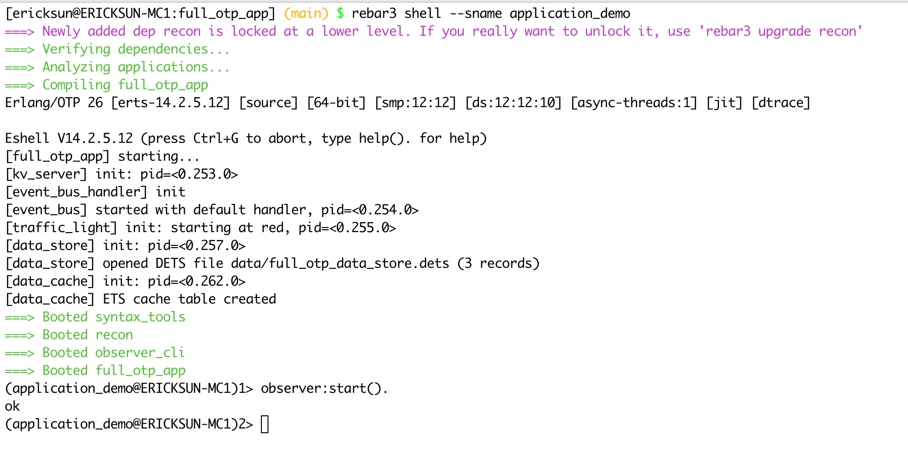

这一张图适合作为课程开场：左侧是 Erlang shell，右侧是 Observer 图形界面。它传达的重点是：Observer 不是外部猜测工具，而是连接到当前 BEAM 节点，直接查看运行时内部结构。

---

## 3. System：先看节点整体状态

Observer 打开后，默认可以先看 `System` 页面。

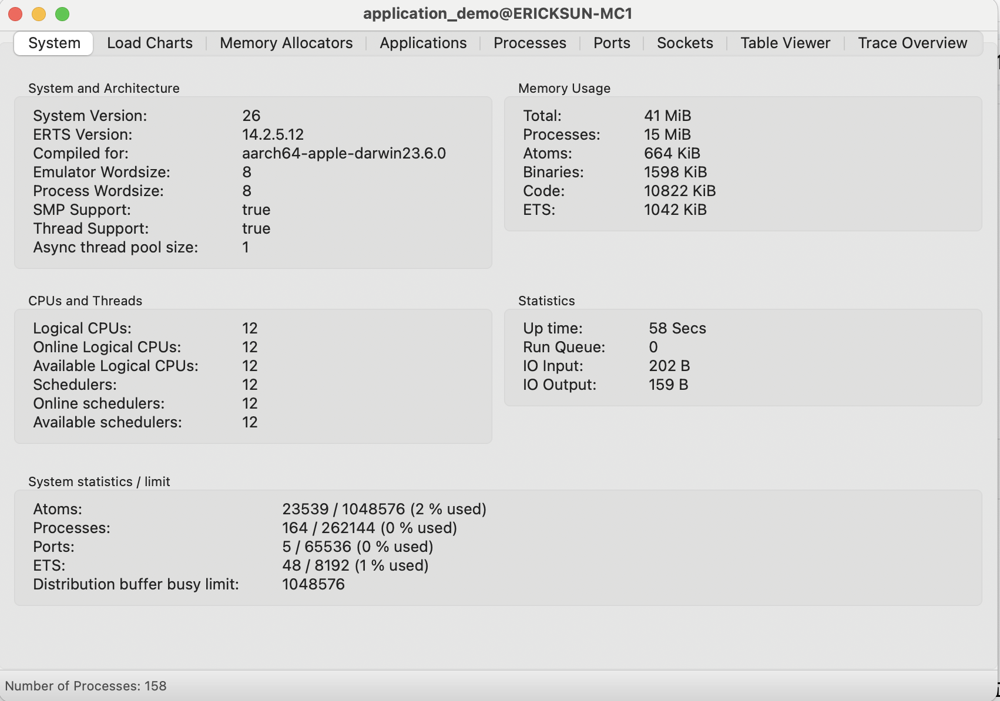

`System` 页面适合建立第一层印象：

- 当前节点名称。
- OTP 版本和系统信息。
- 进程数量。
- 内存使用情况。
- scheduler 信息。
- atom、port、ETS、timer 等运行时资源。

这一页不需要讲得很细。对初学者来说，只要记住：Erlang 节点不是一个黑盒进程，BEAM VM 内部的资源都可以被观察。

---

## 4. Load Charts：观察运行时负载

`Load Charts` 页面展示节点运行时的负载曲线。

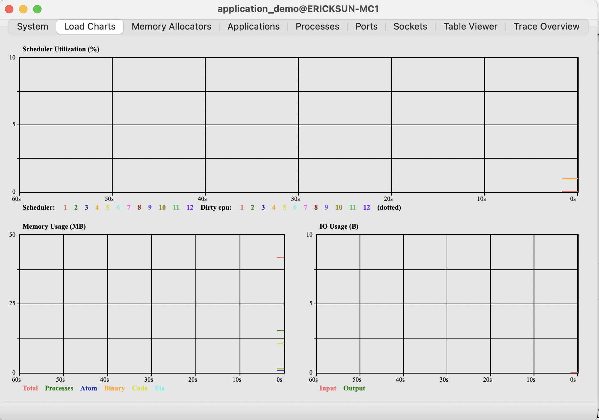

这里可以介绍几个概念：

| 指标 | 说明 |
|------|------|
| Scheduler Utilization | scheduler 使用率，反映 BEAM 调度器是否繁忙 |
| Run Queue | 等待运行的 Erlang process 数量 |
| IO | 输入输出相关负载 |
| Memory | 内存变化趋势 |

这一页可以用来说明：Erlang 的并发不是 OS thread 级别的手工调度，而是 BEAM 调度大量轻量级 Erlang process。

---

## 5. Memory Allocators：观察内存分配器

`Memory Allocators` 页面展示不同 allocator 的内存使用情况。

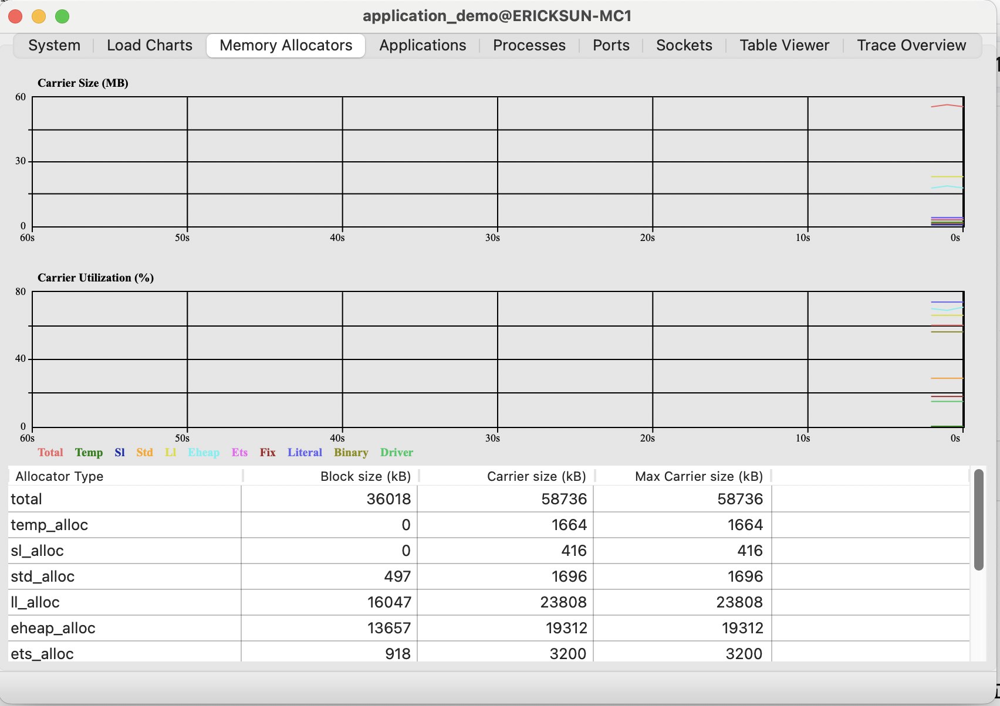

这部分对入门课不需要展开太深。建议只讲两个点：

1. BEAM 的内存不是一个简单总数，内部有不同 allocator。
2. 真正做性能诊断时，Observer 可以帮助定位内存增长来自哪里。

如果课程重点是 OTP，可以快速带过这一页，把主要时间留给 `Applications` 和 `Processes`。

---

## 6. Applications：从 application 开始理解 OTP

`Applications` 页面是本教程的核心。

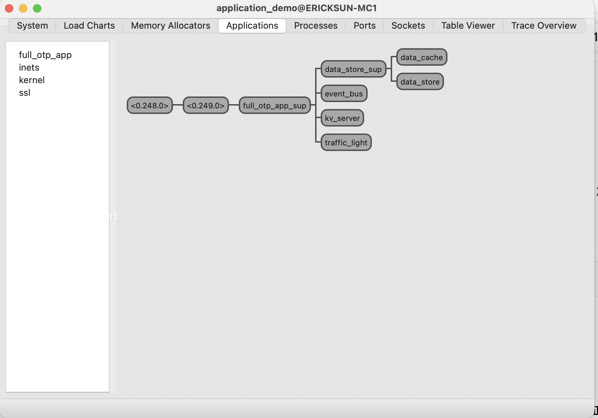

左侧是当前节点启动的 application 列表。常见的系统 application 包括：

- `kernel`
- `stdlib`
- `ssl`
- `inets`
- 自己的业务 application，例如 `full_otp_app`

这正好对应 OTP 的第一层结构：application 是一个可启动、可停止、可管理的应用单元。

---

## 7. 观察系统 application

Observer 不只能看自己的应用，也能看 OTP 自带应用。

### 7.1 kernel

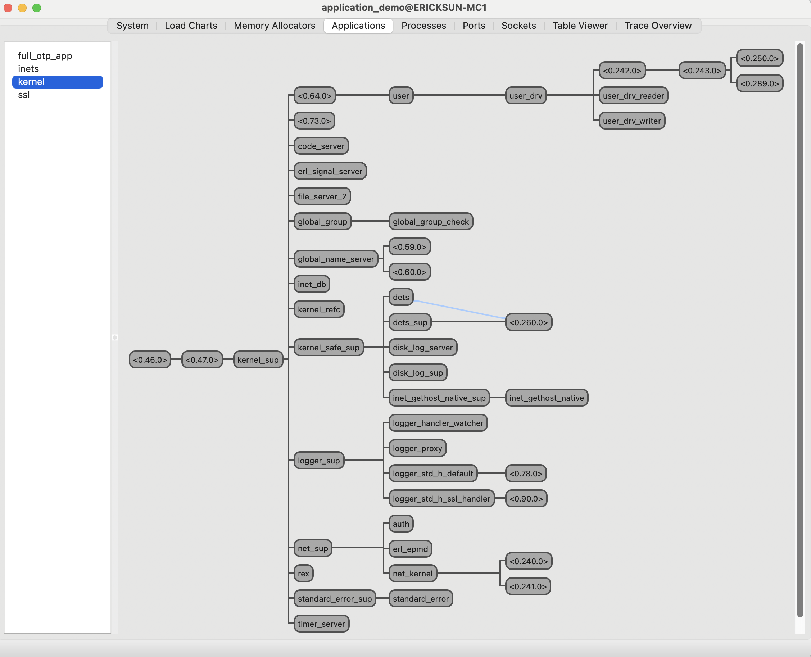

`kernel` 是 Erlang/OTP 最基础的 application，里面包含很多系统级进程。通过这张图可以让学习者理解：OTP 自己也是用 OTP 的方式组织起来的。

### 7.2 ssl

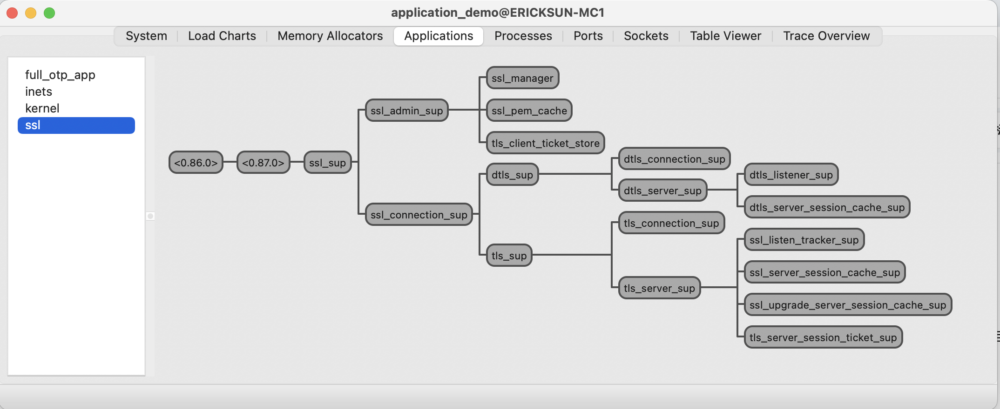

`ssl` application 展示了一个更贴近业务依赖的系统组件。很多网络应用会依赖它。

### 7.3 inets

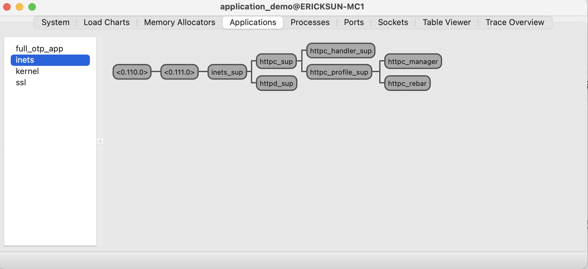

`inets` 里可以看到一棵 supervision tree。这个例子适合说明：不管是 OTP 内置组件，还是我们自己的应用，Observer 都用同一种方式展示 application 和 supervisor tree。

---

## 8. 观察 full_otp_app

选中 `full_otp_app` 后，可以看到当前 demo 应用的 supervision tree。

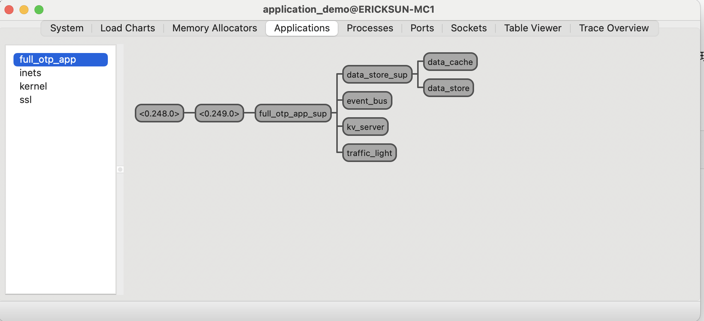

这张图是后续讲 application、supervisor、gen_server、gen_statem 的总入口。

它对应代码中的 application 配置：

```erlang
{application, full_otp_app,
 [{mod, {full_otp_app_app, []}},
  {applications, [kernel, stdlib, observer_cli, recon]}]}.
```

application callback 的职责通常很简单：启动顶层 supervisor。

```erlang
start(_StartType, _StartArgs) ->
    full_otp_app_sup:start_link().
```

所以 Observer 里看到的不是“一个 main 函数”，而是一棵运行中的进程树。

---

## 9. Applications 页面里的 supervisor tree

展开 `full_otp_app` 后，可以看到顶层 supervisor 和它的 children。

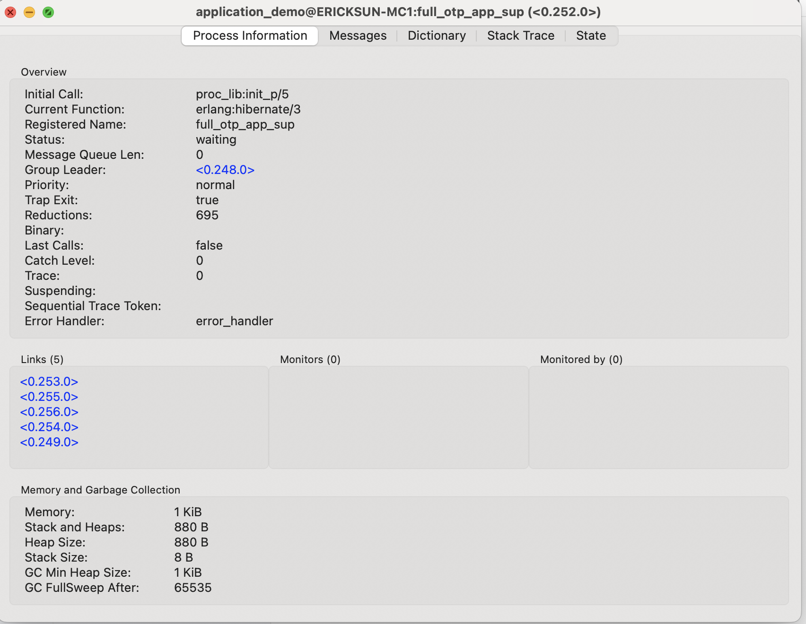

这张图对应 `full_otp_app_sup:init/1` 里的 child specs：

```erlang
ChildSpecs = [
    #{id => kv_server,      start => {kv_server, start_link, []},      type => worker},
    #{id => event_bus,      start => {event_bus, start_link, []},      type => worker},
    #{id => traffic_light,  start => {traffic_light, start_link, []},  type => worker},
    #{id => data_store_sup, start => {data_store_sup, start_link, []}, type => supervisor}
].
```

重点讲解：

- `full_otp_app_sup` 是顶层 supervisor。
- `kv_server` 是一个 `gen_server` worker。
- `event_bus` 是一个 `gen_event` worker。
- `traffic_light` 是一个 `gen_statem` worker。
- `data_store_sup` 是子 supervisor。
- `data_store_sup` 下面还有 `data_store` 和 `data_cache`。

这就是 OTP 的核心直觉：系统不是一堆函数调用，而是一棵由 supervisor 管理的进程树。

另一张 supervisor tree 截图可以用于展示子监督树：

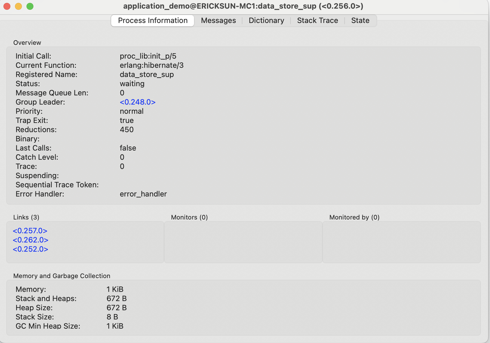

---

## 10. Processes：从进程列表看运行时

切换到 `Processes` 页面，可以看到当前 BEAM 节点中的所有 Erlang process。

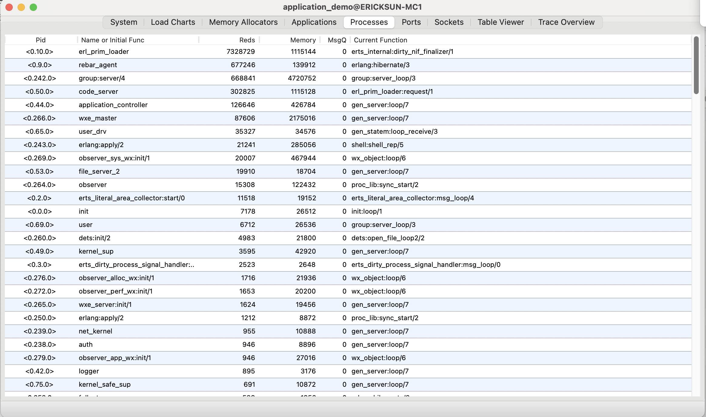

表格里最重要的列包括：

| 列 | 说明 |
|----|------|
| Pid | Erlang process id |
| Name or Initial Func | 注册名或初始调用函数 |
| Reds | reductions，近似理解为调度执行量 |
| Memory | 进程占用内存 |
| MsgQ | 消息队列长度 |
| Current Function | 当前正在执行或等待的位置 |

这里建议重点讲 `MsgQ`。在 Erlang 系统里，进程之间通过消息通信。如果某个进程处理不过来，消息队列长度可能增长。Observer 可以直接看到这一点。

---

## 11. 双击进程：Process Information

在 `Processes` 页面或 `Applications` 页面里双击某个进程，可以打开进程详情窗口。

### 11.1 supervisor 进程详情

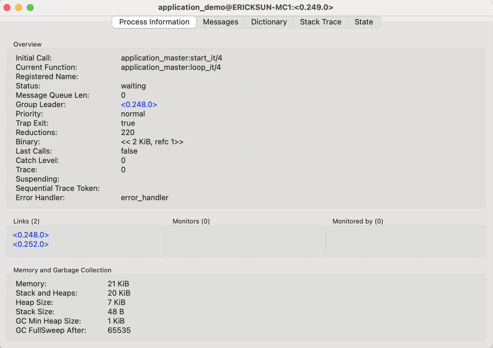

这张图展示的是 `full_otp_app_sup` 的进程详情。重点观察：

- `Registered Name` 是 `full_otp_app_sup`。
- `Current Function` 可能是 `erlang:hibernate/3`，表示当前空闲等待。
- `Message Queue Len` 是消息队列长度。
- `Links` 显示它链接到哪些子进程或相关进程。
- `Trap Exit` 对 supervisor 很重要，因为它需要接收子进程退出信号。

这可以帮助解释：supervisor 不是抽象配置，它本身就是一个真实运行的 Erlang process。

### 11.2 gen_server 进程详情：kv_server

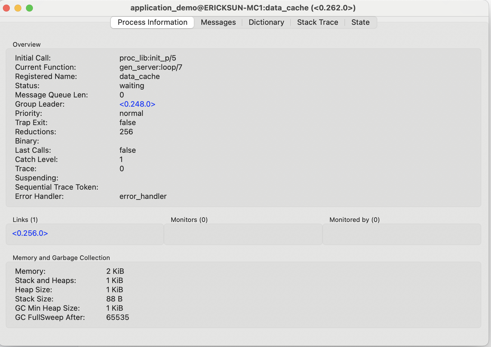

`kv_server` 是 demo 中的 key-value store，对应源码 `kv_server.erl`。

它的 API 包括：

```erlang
kv_server:put(name, "Erlang").
kv_server:get(name).
kv_server:delete(name).
kv_server:all().
kv_server:clear().
```

在进程详情里可以重点观察：

- `Registered Name` 是 `kv_server`。
- `Current Function` 通常是 `gen_server:loop/7`。
- `Message Queue Len` 可以观察是否堆积消息。
- `Memory` 和 `Reductions` 可以观察进程资源消耗。

这时再回到代码讲 `handle_call/3`、`handle_cast/2`、`handle_info/2`，学习者会更容易理解：这些 callback 是运行中进程处理消息的入口。

---

## 12. State：查看 OTP behaviour 状态

Process Information 窗口上方有多个 tab：

```text
Process Information | Messages | Dictionary | Stack Trace | State
```

其中 `State` 对学习 OTP 特别有价值，因为它能显示 `gen_server` 或 `gen_statem` 的内部状态。

### 12.1 kv_server 的 State

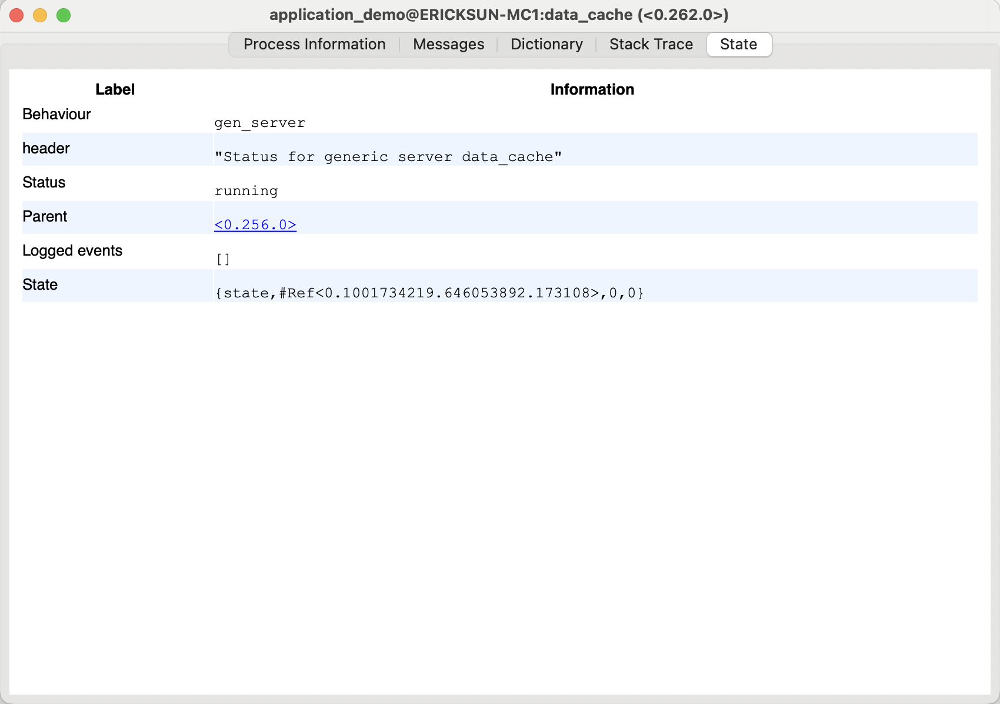

`kv_server` 的状态是一个 record：

```erlang
-record(state, {
    store = #{} :: map(),
    ops_count = 0 :: non_neg_integer()
}).
```

当执行：

```erlang
kv_server:put(language, "Erlang").
kv_server:put(version, "OTP 27").
```

再查看 `State` 页面，就可以看到内部 map 和操作计数的变化。

这能非常直观地说明：`gen_server` 的 State 不是全局变量，也不是类成员变量，而是某个 Erlang process 私有持有的数据。

### 12.2 data_store / data_cache 进程详情

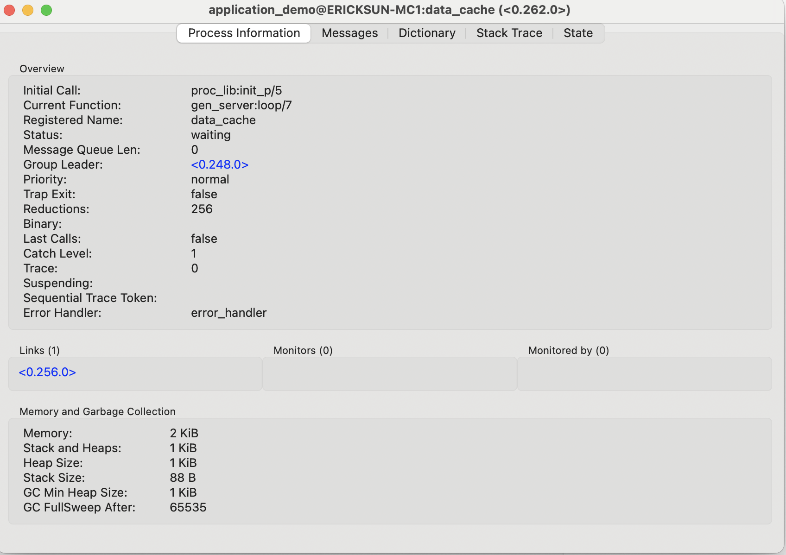

`data_store` 是基于 DETS 的持久化进程，`data_cache` 是 ETS 缓存进程。它们由 `data_store_sup` 这个子 supervisor 管理。

`data_cache` 的状态截图：

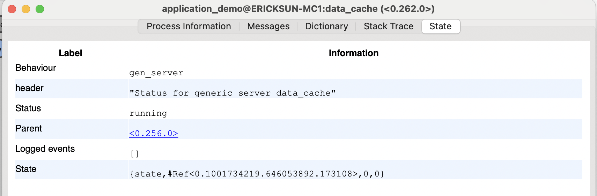

这个例子适合说明两点：

1. OTP 系统中可以有 supervisor under supervisor。
2. 每个 worker 都可以单独观察它的进程信息和状态。

---

## 13. gen_statem：观察状态机进程

`traffic_light` 是一个 `gen_statem`，用来模拟红绿灯状态机。

状态转换如下：

```text
red -> green -> yellow -> red
```

也支持外部事件：

```erlang
traffic_light:current_state().
traffic_light:next().
traffic_light:emergency().
traffic_light:resume().
```

### 13.1 traffic_light 进程详情

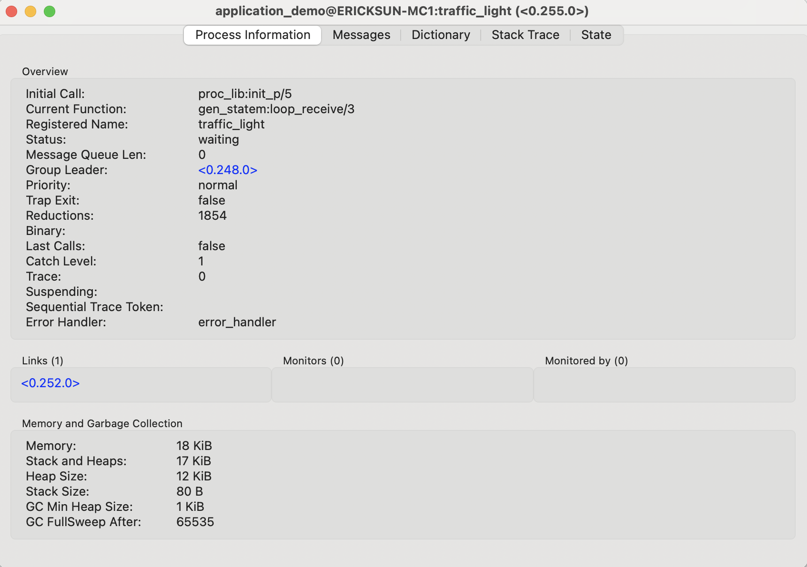

可以看到它也是一个普通 Erlang process，只是 current function 和 State 展示会体现 `gen_statem` 的运行模型。

### 13.2 traffic_light 的 State

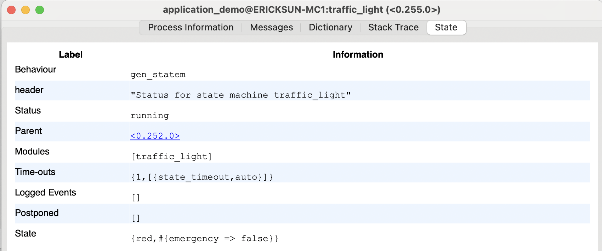

`State` 页面里能看到：

- Behaviour 是 `gen_statem`。
- 当前状态机状态，例如 `red`。
- 状态数据，例如 `#{emergency => false}`。
- timeout 信息，例如 `{state_timeout, auto}`。

这张图非常适合讲 `gen_server` 和 `gen_statem` 的区别：

- `gen_server` 更像“长期运行的状态服务”。
- `gen_statem` 更像“显式状态机”。
- Observer 能直接看到当前状态机状态和数据。

---

## 14. Messages / Dictionary / Stack Trace：继续深入进程内部

进程详情窗口里除了 `State`，还有几个非常适合调试的 tab：

| Tab | 用途 | 课堂讲解重点 |
|-----|------|--------------|
| Messages | 查看当前进程 mailbox 中还没处理的消息 | 进程不是函数调用栈，而是靠消息驱动 |
| Dictionary | 查看进程字典 | 进程可以携带局部字典，但业务代码不要滥用 |
| Stack Trace | 查看当前调用栈 | 判断进程当前卡在哪个调用路径上 |
| State | 查看 OTP behaviour 的状态 | 本课重点，用来观察 `gen_server` / `gen_statem` 状态 |

### 14.1 Messages：观察 mailbox

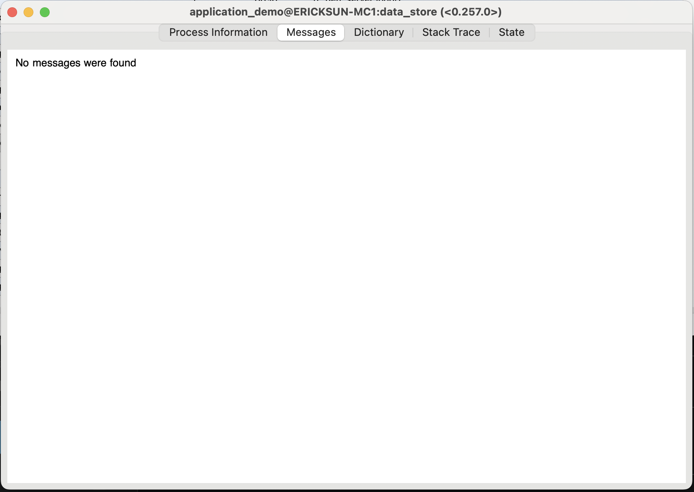

`Messages` tab 对应进程邮箱中尚未处理的消息。它适合和进程列表里的 `MsgQ` 一起讲：

```text
MsgQ 数值变大
  -> 说明消息进入速度可能大于处理速度
      -> 双击进程进入 Messages
          -> 观察具体积压了哪些消息
```

录课时可以强调：Erlang 进程之间不是共享内存，而是通过消息通信。`Messages` 页面就是把这种运行时通信方式可视化。

### 14.2 Dictionary：观察进程字典

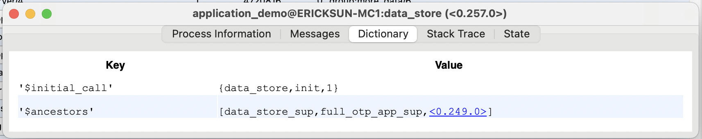

`Dictionary` tab 展示当前进程的 process dictionary。

进程字典可以理解为“挂在某个进程上的局部键值表”。它有调试价值，但入门课要提醒学习者：普通业务逻辑不要把它当成全局变量或对象字段来滥用，否则代码会变得隐式、难测试。

这一页适合点到为止：知道 Observer 能看到它即可，不建议在前期课程里深入使用。

### 14.3 Stack Trace：观察进程当前调用栈

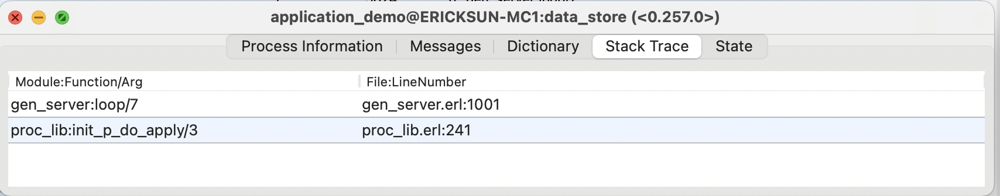

`Stack Trace` tab 用来查看进程当前正在执行的调用路径。

它适合用于这些场景：

- 某个进程 CPU 占用异常，想知道它正在跑什么代码。
- 某个 `gen_server` 响应慢，想判断是否卡在某个函数里。
- 教学时说明：BEAM 进程虽然轻量，但仍然是有当前执行栈的运行实体。

入门课可以把它和 `State` 区分开：

```text
State       -> 这个 OTP 进程保存了什么业务状态
Stack Trace -> 这个进程此刻正在执行什么调用路径
Messages    -> 这个进程还有哪些消息没处理
```

---

## 15. Table Viewer：查看 ETS / DETS 表

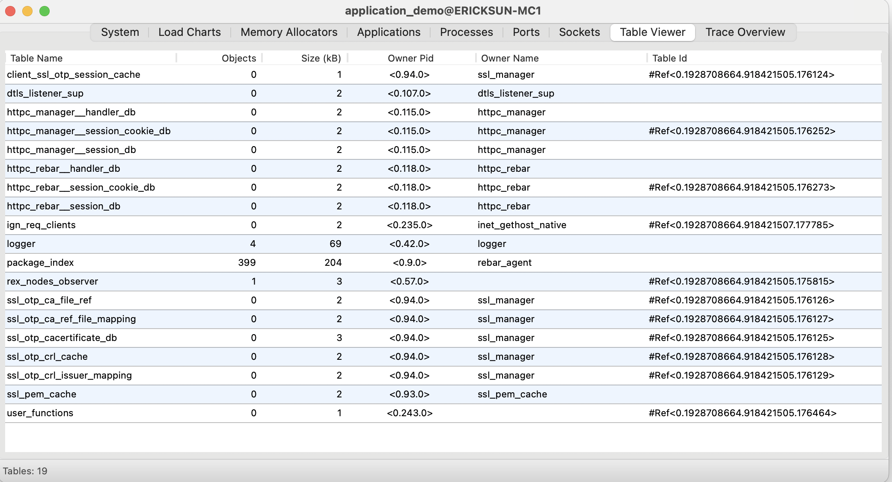

`Table Viewer` 用来查看节点里的 ETS / DETS 表。对于本 demo 来说，它可以和 `data_store` / `data_cache` 放在一起讲：

- `data_cache` 更适合对应 ETS 这类内存表概念。
- `data_store` 更适合对应 DETS 这类磁盘表概念。
- Observer 让“进程状态”和“表数据”可以分开观察。

教学时可以这样连接：

```text
Applications / Processes
  -> 看 OTP 进程结构

Process Information / State
  -> 看某个 gen_server 的内部状态

Table Viewer
  -> 看节点里的表数据，例如 ETS / DETS
```

这样学习者会更容易理解：OTP 系统不只是一些模块文件，而是由进程、消息、状态、表数据一起组成的运行时系统。

---

## 16. 从 Observer 回到代码

Observer 不是为了替代代码阅读，而是帮助我们建立代码和运行时之间的映射。

| Observer 里看到的内容 | 对应代码 |
|----------------------|----------|
| `full_otp_app` application | `full_otp_app.app.src` 和 `full_otp_app_app.erl` |
| `full_otp_app_sup` | `full_otp_app_sup.erl` |
| `kv_server` worker | `kv_server.erl` |
| `traffic_light` worker | `traffic_light.erl` |
| `data_store_sup` 子 supervisor | `data_store_sup.erl` |
| `data_store` / `data_cache` | `data_store.erl` / `data_cache.erl` |
| Process Information | `process_info/1` 能看到的很多信息 |
| State tab | `sys:get_state/1` 和 behaviour 内部状态 |

所以本教程后续讲 OTP 时，可以固定使用这个顺序：

```text
先看 Observer 里的现象
  -> 再看对应源码
      -> 再回到 Observer 验证运行时变化
```

---

## 17. 课堂演示建议

建议录课时按这个顺序演示：

1. 启动 `rebar3 shell --sname application_demo`。
2. 执行 `observer:start().`。
3. 看 `System` 页面，说明 Observer 是节点观察工具。
4. 切到 `Applications` 页面。
5. 先快速看 `kernel`、`ssl`、`inets`。
6. 选中 `full_otp_app`。
7. 展开 supervision tree。
8. 双击 `full_otp_app_sup`，说明 supervisor 也是进程。
9. 双击 `kv_server`，说明 `gen_server` 进程信息。
10. 切到 `kv_server` 的 `State`，执行 `kv_server:put/2` 后观察状态变化。
11. 切到 `Messages`、`Dictionary`、`Stack Trace`，说明进程还可以继续向内观察。
12. 双击 `traffic_light`，切到 `State`，观察 `gen_statem` 当前状态。
13. 执行 `traffic_light:next().`，再观察状态变化。
14. 打开 `Table Viewer`，说明 ETS / DETS 这类表数据也能在 Observer 中查看。
15. 展示 `Processes` 页面，说明所有进程都在同一个节点里。
16. 结尾说明：后续会加入 `observer_cli`，用于命令行环境观察节点。

---

## 18. Observer 和 observer_cli 的关系

GUI Observer 适合本地开发、教学录屏和截图讲解；`observer_cli` 适合 SSH 到服务器、容器环境或没有图形界面的远程节点。

简单理解：

```text
Observer      -> 图形界面，适合讲结构：application / supervisor / worker
observer_cli  -> 命令行界面，适合看指标：进程数、内存、reductions、MsgQ、ETS
```

当前 demo 已经在 `rebar.config` 中加入：

```erlang
{deps, [
    {observer_cli, "1.8.8"},
    {recon, "2.5.6"}
]}.
```

### 18.1 启动 observer_cli


在 `rebar3 shell` 中启动：

```erlang
observer_cli:start().
```

启动后默认进入 Home 页面。顶部菜单可以看到：

```text
Home(H) | Network(N) | System(S) | Ets(E) | App(A) | Doc(D) | Plugin(P)
```

常用按键：

| 按键 | 用途 |
|------|------|
| `H` | 回到 Home 页面 |
| `A` | 查看 application 聚合信息 |
| `E` | 查看 ETS 信息 |
| `S` | 查看系统信息 |
| `N` | 查看网络信息 |
| `F` / `B` | 下一页 / 上一页 |
| `q` | 退出 |

### 18.2 App(A)：查看所有 application

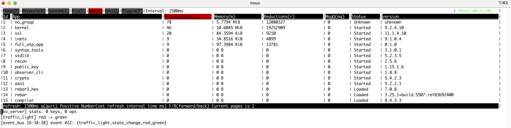

按 `A` 进入 App 页面后，可以看到所有 application 的聚合指标：

| 列 | 含义 |
|----|------|
| `App` | application 名称 |
| `ProcessCount(p)` | 归属到该 application 的进程数量 |
| `Memory(m)` | 聚合内存占用 |
| `Reductions(r)` | 聚合 reductions |
| `MsgQ(mq)` | 聚合消息队列长度 |
| `Status` | `Started` / `Loaded` 等状态 |
| `version` | application 版本 |

这里可以重点观察 demo 应用：

```text
full_otp_app
```

例如截图中 `full_otp_app` 处于 `Started` 状态，并且能看到进程数量、内存和 reductions。

需要特别说明：`observer_cli` 的 App 页面不能像 GUI Observer 那样选中某个 application 后展开 supervisor tree。这里的行号只是表格编号，不是可进入的菜单项。它适合看 application 资源聚合，不适合讲 supervision tree 结构。

对比关系是：

```text
Observer GUI Applications
  -> application -> supervisor -> worker
  -> 适合讲结构

observer_cli App(A)
  -> application -> ProcessCount / Memory / Reductions / MsgQ
  -> 适合看资源指标
```

如果要在命令行查看 `full_otp_app` 的监督树，仍然使用 Erlang shell：

```erlang
supervisor:which_children(full_otp_app_sup).
supervisor:which_children(data_store_sup).
```

### 18.3 Processes：查看进程列表和进程详情

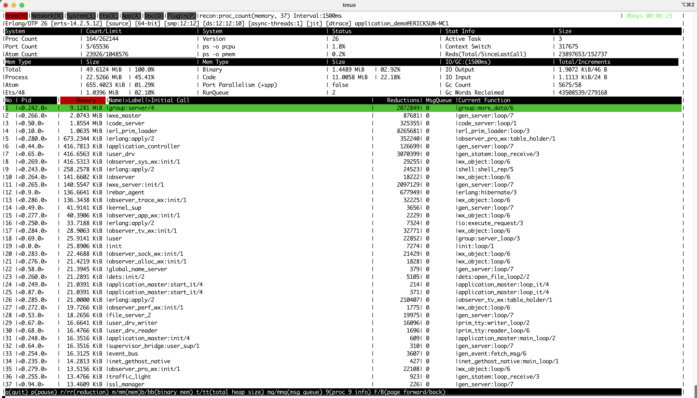

Home 页面下半部分就是进程列表。它按当前选择的指标排序，例如 memory、reductions、binary memory、message queue。

常用按键：

| 按键 | 用途 |
|------|------|
| `m` | 按 memory 排序 |
| `r` | 按 reductions 排序 |
| `mq` | 按 message queue 排序 |
| `F` / `B` | 下一页 / 上一页 |
| 输入进程行号 | 打开该进程详情 |

这一点和 App 页面不同：进程列表中的行号可以进入进程详情，App 页面中的 application 行号不能进入详情。

教学时可以查找这些 demo 进程：

```text
full_otp_app_sup
kv_server
event_bus
traffic_light
data_store_sup
data_store
data_cache
```

进入进程详情后，可以看到 `process_info/2` 能拿到的很多运行时信息，例如 registered name、links、monitors、message queue、dictionary、current stack 和 state。

### 18.4 Ets(E)：查看 ETS 表

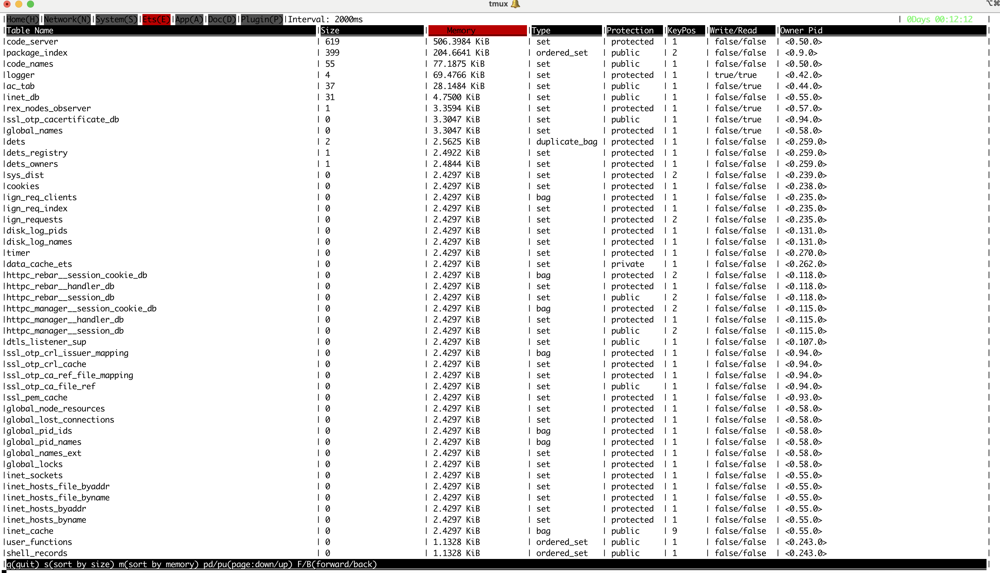

按 `E` 可以进入 ETS 页面。它适合和 GUI Observer 的 `Table Viewer` 对比：

```text
GUI Observer Table Viewer
  -> 图形化查看 ETS / DETS

observer_cli Ets(E)
  -> 终端中查看 ETS 表指标
```

对于线上排查，`observer_cli` 的 ETS 页面更实用，因为它不依赖桌面环境，可以直接在服务器终端里看表数量、表大小和相关指标。

### 18.5 用 Erlang API 获取 observer_cli 类似数据

为了说明 `observer_cli` 不是魔法，本 demo 额外提供了一个脚本：

```text
full_otp_app/scripts/observer_cli_snapshot.escript
```

这个脚本直接调用 Erlang runtime introspection API，采集一次类似 `observer_cli` 的快照数据。它的使用方式、参数含义和实现原理已经拆到独立文档：

```text
observer_cli_snapshot_escript.md
```

---

## 19. 当前已有截图清单

当前 `images/` 目录已有这些截图，可以支撑本文：

| 图片 | 用途 |
|------|------|
| `observer_start.png` | 启动 Observer |
| `System.png` | System 页面 |
| `Load_Charts.png` | Load Charts 页面 |
| `Memory_Allocators.png` | Memory Allocators 页面 |
| `Applications.png` | Applications 总览 |
| `Applications_kernel.png` | kernel application |
| `Applications_ssl.png` | ssl application |
| `Applications_inets.png` | inets application |
| `Applications_app.png` | full_otp_app 总览 |
| `Applications_app_supervisor.png` | full_otp_app supervisor tree |
| `Applications_app_supervisor_second.png` | 子监督树 |
| `Applications_process_list.png` | Processes 页面 |
| `Applications_app_gen_server_process.png` | kv_server 进程详情 |
| `Applications_app_gen_server_state.png` | kv_server State |
| `Applications_app_gen_server_process_data_store.png` | data_store 进程详情 |
| `Applications_app_gen_server_process_data_store_state.png` | data_cache/data_store State |
| `Applications_app_traffic_light_process.png` | traffic_light 进程详情 |
| `Applications_app_traffic_light_state.png` | traffic_light State |
| `Process_Messages.png` | Process Information 的 Messages tab |
| `Process_Dictionary.png` | Process Information 的 Dictionary tab |
| `Process_Stack_Trace.png` | Process Information 的 Stack Trace tab |
| `Table_Viewer.png` | Table Viewer 页面，查看 ETS / DETS 表数据 |
| `observer_cli_start.png` | 启动 observer_cli |
| `observer_cli_application.png` | observer_cli 的 App(A) 页面 |
| `observer_cli_processes.png` | observer_cli 的进程列表 |
| `observer_ets.png` | observer_cli 的 Ets(E) 页面 |

---

## 20. 建议补充截图

目前图片已经能完成 Observer GUI 和 `observer_cli` 入门讲解。后续如果要继续扩展，可以补充更细的进程详情截图：

| 建议文件名 | 截图内容 | 用途 |
|------------|----------|------|
| `observer_cli_process_info.png` | observer_cli 中输入进程行号后的进程详情 | 对比 GUI Process Information |
| `observer_cli_system.png` | observer_cli 的 System(S) 页面 | 对比 GUI System 页面 |
| `observer_cli_network.png` | observer_cli 的 Network(N) 页面 | 讲远程节点或网络 IO 时使用 |

---

## 21. 小结

Observer 是学习 Erlang/OTP 的非常重要的入口。它让我们不只是阅读代码，而是直接观察运行中的系统。

本篇最重要的结论是：

```text
application 不是抽象名词，可以在 Observer 里看到。
supervisor 不是配置文件，它本身是进程。
gen_server 不是普通对象，它是有 mailbox 和私有状态的 BEAM process。
gen_statem 可以直接显示当前状态机状态。
Observer 把 OTP 的运行时结构可视化了。
```

后续讲 `application`、`supervisor`、`gen_server`、`gen_statem` 时，都可以从这篇 Observer 文档开始，把代码和运行时结构连接起来。
